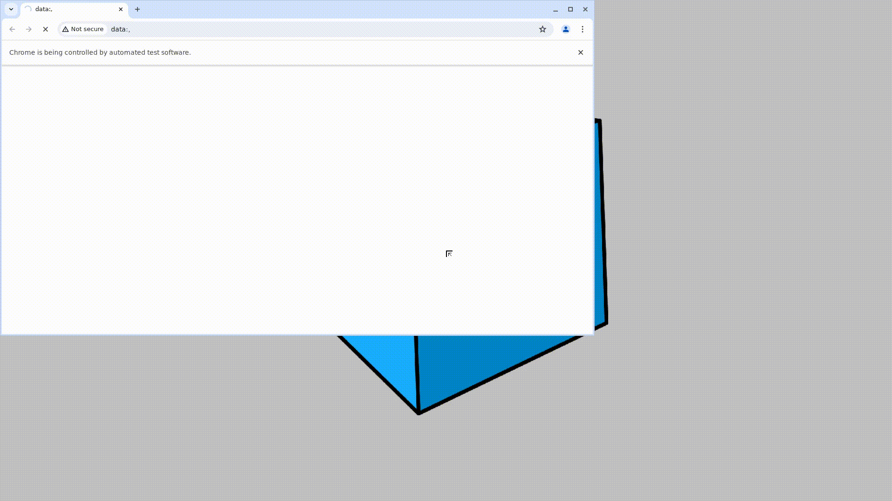

# Пример проекта автотестов для сайта [T‑Ж](https://t-j.ru)
> T‑Ж – журнал про ваши деньги. Этот ресурс предлагает актуальные статьи, аналитические материалы и интерактивные сервисы, помогающие пользователям разбираться в финансовых вопросах и принимать обоснованные решения.

### Используемые технологии
<p align="center">
  
  
  
  
  
  
</p>

## Покрываемый функционал
- Проверка title страницы T‑Ж
- Поиск инструментов на сайте T‑Ж
- Проверка навигационного меню 
- Cценарий работы калькулятора

## Запуск тестов

### Локально
Важно! Перед запуском нужно создать файл `.env` и указать в нём SELENOID_LOGIN, SELENOID_PASS и SELENOID_URL

Для запуска тестов локально выполните следующие шаги:
1. Склонировать репозиторий.
2. Открыть проект в PyCharm.
3. В терминале выполнить следующие команды:
   ```
   python -m venv .venv
   source .venv/bin/activate
   pip install -r requirements.txt
   
### С помощью [Jenkins](https://jenkins.autotests.cloud/job/C17-gonchrrv-lesson_14/)
#### Для запуска автотестов необходимо:
- Открыть [джобу](https://jenkins.autotests.cloud/job/C17-gonchrrv-lesson_14/) в Jenkins.
- Нажать на кнопку **Build with Parameters**.
- Выбрать необходимые значения параметров `BROWSER_TYPE` и `BROWSER_VERSION`.
- Нажать на **Build**.


## Отчет о прохождении тестов (Allure)

### Локально
Для получения отчёта нужно ввести команду 
```allure serve allure-results```

Ниже представлен пример Allure отчёта:


Видео прохождения теста:



Подробные инструкции по работе с Allure можно найти по [ссылке](https://allurereport.org/docs/).


### В проекте реализована интеграция с Allure TestOps и Atlassian Jira
Интеграция с Allure TestOps:


Интеграция с Atlassian Jira:


### В проекте настроена отправка краткого отчёта в Telegram

